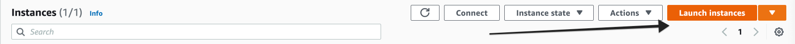
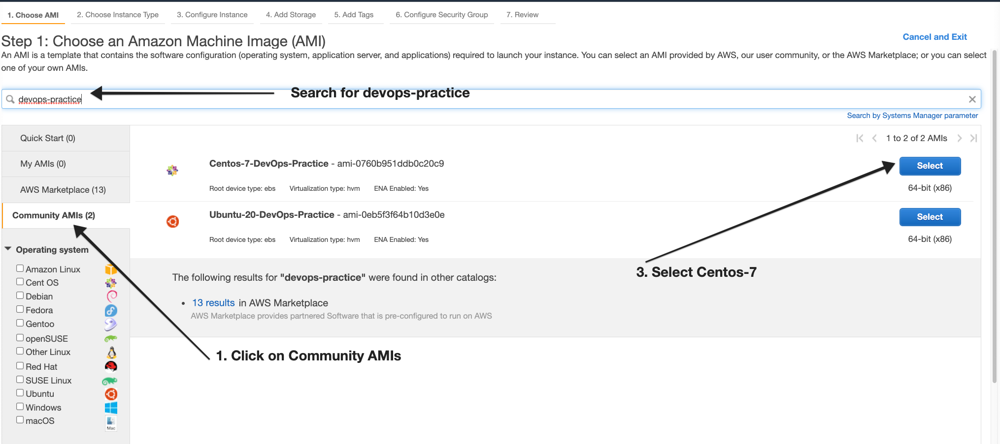
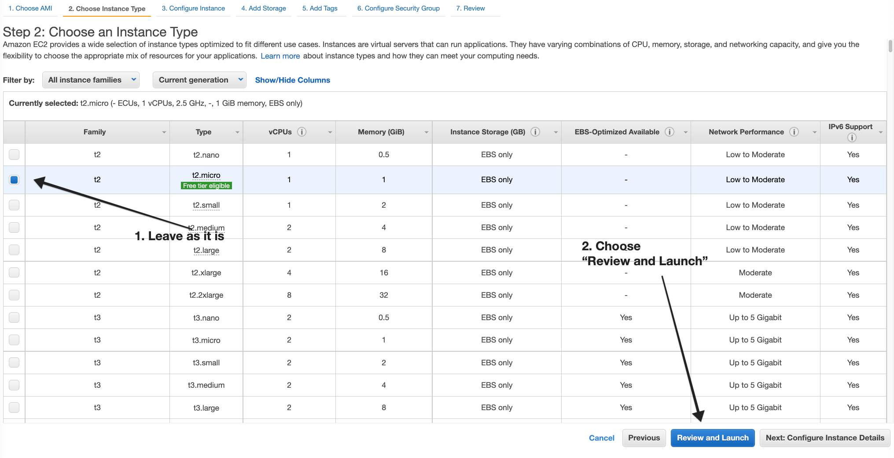
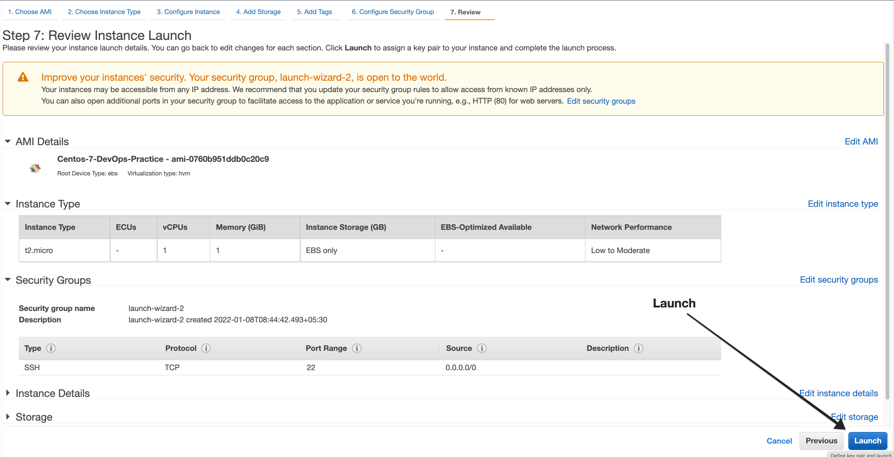
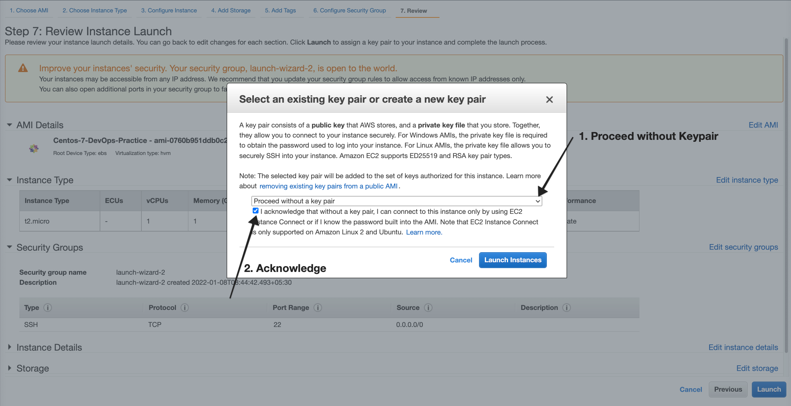

## 1. Choose N.Virginia Region in AWS

## 2. Goto EC2 Service 

## 3. Launch an Instance 

https://console.aws.amazon.com/ec2/v2/home?region=us-east-1#Instances:

## 4. Take the Public IP address and connect with Putty.

# Username / Password : 
#                       root / DevOps321 
#                       centos / DevOps321
